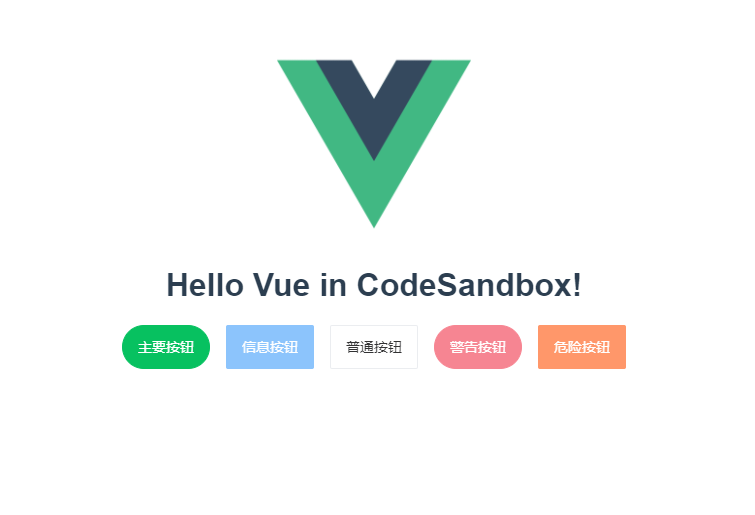
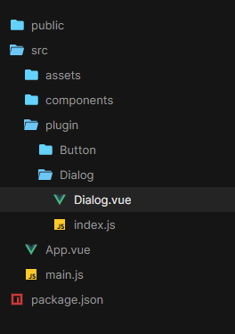
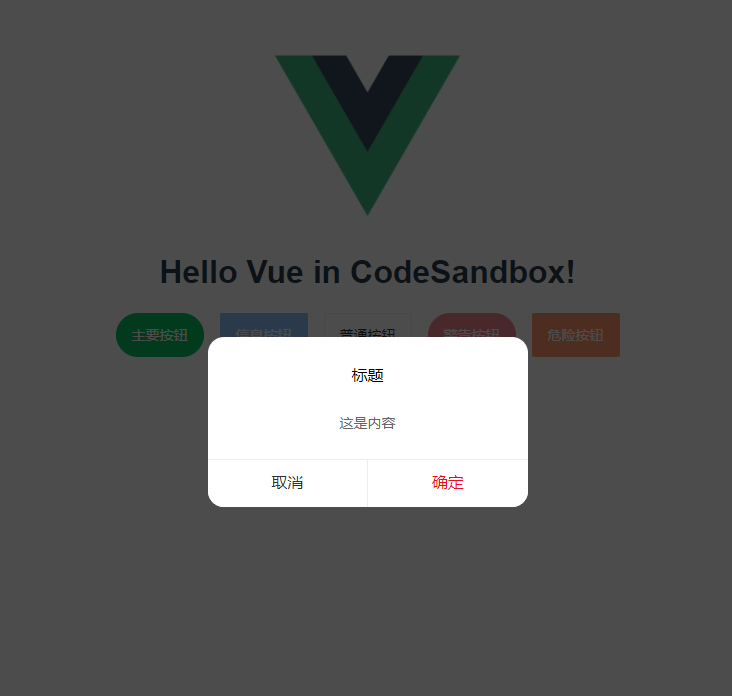

# Vue 指南

## 注册组件

### 全局注册

```js
Vue.component('component-a', {
    /* ... */
})
Vue.component('component-b', {
    /* ... */
})
Vue.component('component-c', {
    /* ... */
})

new Vue({
    el: '#app'
})
```

```html
<div id="app">
    <component-a></component-a>
    <component-b></component-b>
    <component-c></component-c>
</div>
```

### 局部注册

```js
import ComponentA from './ComponentA.vue'

export default {
    components: {
        ComponentA
    },
    // ...
}
```

## 动态&异步加载组件

```vue
<template>
  <div id="app">
    
    <component v-bind:is="currentTabComponent"></component>
  </div>
</template>

<script>
import Loading from "./components/Loading";
import Err from "./components/Err";
export default {
  name: "App",
  data() {
    return {
      currentTabComponent: "",
    };
  },
  methods: {
    addMod() {
      console.log(this);
      if (this.currentTabComponent) {
        alert("onready");
      } else {
        this.currentTabComponent = () => ({
          // 需要加载的组件。应当是一个 Promise
          component: import("./components/Demo"),
          // 加载中应当渲染的组件
          loading: Loading,
          // 出错时渲染的组件
          error: Err,
          // 渲染加载中组件前的等待时间。默认：200ms。
          delay: 200,
          // 最长等待时间。超出此时间则渲染错误组件。默认：Infinity
          timeout: 3000,
        });
      }
    },
  },
};
</script>
```

* [动态组件 & 异步组件](https://cn.vuejs.org/v2/guide/components-dynamic-async.html#%E5%A4%84%E7%90%86%E5%8A%A0%E8%BD%BD%E7%8A%B6%E6%80%81)

## 写个插件？如何调用？

```js
MyPlugin.install = function(Vue, options) {
    // 1. 添加全局方法或 property
    Vue.myGlobalMethod = function() {
        // 逻辑...
    }

    // 2. 添加全局资源
    Vue.directive('my-directive', {
        bind(el, binding, vnode, oldVnode) {
            // 逻辑...
        }
        ...
    })

    // 3. 注入组件选项
    Vue.mixin({
        created: function() {
                // 逻辑...
            }
            ...
    })

    // 4. 添加实例方法
    Vue.prototype.$myMethod = function(methodOptions) {
        // 逻辑...
    }
}
```

main.js中调用

```js
import MyPlugin from "./plugin/MyPlugin";
// 调用 `MyPlugin.install(Vue)`
Vue.use(MyPlugin)

new Vue({
    // ...组件选项
})
```

## 如何写个自己的UI组件库？

### Button初体验

目录结构


 `Button.vue`

```vue
<template>
  <button
    class="my-buttom my-button--normal"
    :class="[
      type ? `my-button--${type}` : '',
      {
        'my-button--round': round,
        'my-button--disabled': disabled,
      },
    ]"
    @click="handleClick"
  >
    <slot></slot>
  </button>
</template>

<script>
export default {
  name: "Button",
  props: {
    type: {
      type: String,
      default: "default",
    },
    round: {
      type: Boolean,
      default: false,
    },
    disabled: {
      type: Boolean,
      default: false,
    },
  },
  methods: {
    handleClick(evt) {
      this.$emit("click", evt);
    },
  },
};
</script>

```

 `index.js`

```js
import Buttom from "./Button.vue";

/* istanbul ignore next */
Buttom.install = function(Vue) {
    Vue.component(Buttom.name, Buttom);
};

export default Buttom;
```

`main.js` 中调用

```js
import Vue from "vue";
import App from "./App.vue";
import Buttom from "./plugin/Button";

Vue.use(Buttom);
Vue.config.productionTip = false;

new Vue({
    render: (h) => h(App)
}).$mount("#app");
```

在 `App.vue` 中使用，测试一下

```vue
<template>
  <div id="app">
    
    <HelloWorld msg="Hello Vue in CodeSandbox!" />

    <div class="test-btn">
      <Button round type="primary">主要按钮</Button>
      <Button disabled type="info">信息按钮</Button>
      <Button type="default">普通按钮</Button>
      <Button disabled round type="warning">警告按钮</Button>
      <Button type="danger">危险按钮</Button>
    </div>
  </div>
</template>

<script>
import HelloWorld from "./components/HelloWorld";
export default {
  name: "App",
  components: {
    HelloWorld,
  },
};
</script>

```

看看效果



### 全局组件不一样的调用方法？Dialog （函数式组件）

目录结构



 `Dialog.vue`

```vue
 <template>
  <div class="my-dialog-wrap" v-if="isShow">
    <div class="my-dialog-mask" v-if="!maskHide"></div>
    <div class="my-dialog">
      <h4 class="my-dialog-title">{{ title }}</h4>
      <div class="my-dialog-content">
        <slot>{{ content }}</slot>
      </div>
      <div class="my-dialog-btn">
        <button
          @click="cancel"
          class="my-dialog--cancel"
          v-if="isShowCancelBtn"
        >
          {{ cancelVal }}
        </button>
        <button @click="confirm" class="my-dialog--confirm">
          {{ confirmVal }}
        </button>
      </div>
    </div>

  </div>
</template>

<script>
export default {
  name: "Dialog", 
  props: {

    title: {
      type: String,
      default: "标题",
    },
    content: {
      type: String,
      default: "这是内容",
    },
    confirmVal: {
      type: String,
      default: "确定",
    },
    cancelVal: {
      type: String,
      default: "取消",
    },
    maskHide: {
      type: Boolean,
      default: false,
    },
    isShowCancelBtn: {
      type: Boolean,
      default: true,
    },

  }, 
  data() {

    return {
      isShow: false,
    };

  }, 
  methods: {

    show() {
      this.isShow = true;
    },
    hide() {
      this.isShow = false;
    },
    confirm() {
      this.isShow = false;
      console.log("confirm");
    },
    cancel() {
      this.isShow = false;
      console.log("cancel");
    },

  }, 
}; 
</script>
```

 `index.js`

```js
import Dialog from "./Dialog.vue";

/* istanbul ignore next */
Dialog.install = function(Vue) {
    Vue.component(Dialog.name, Dialog);
    // 1. 创建组件构造器
    const dialogContrustor = Vue.extend(Dialog);

    // 2. new  组件实例
    const dialog = new dialogContrustor();

    // 3. 获取el
    const el = dialog.$mount().$el;

    // 4. 添加到document.body
    document.body.appendChild(el);

    // 5. 添加到原型链上
    Vue.prototype.$dialog = dialog;
};

export default Dialog;
```

`main.js` 中引用

```js
import Vue from "vue";
import App from "./App.vue";
import Buttom from "./plugin/Button";
import Dialog from "./plugin/Dialog";

Vue.use(Buttom);
Vue.use(Dialog);
Vue.config.productionTip = false;

new Vue({
    render: (h) => h(App)
}).$mount("#app");
```

在 `App.vue` 中使用，测试一下

```vue
<template>
  <div id="app">
    
    <HelloWorld msg="Hello Vue in CodeSandbox!" />

    <div class="test-btn">
      <Button round type="primary">主要按钮</Button>
      <Button disabled type="info">信息按钮</Button>
      <Button type="default">普通按钮</Button>
      <Button disabled round type="warning">警告按钮</Button>
      <Button @click="clickMe" type="danger">危险按钮</Button>
    </div>
  </div>
</template>

<script>
import HelloWorld from "./components/HelloWorld";
export default {
  name: "App",
  components: {
    HelloWorld,
  },
  methods: {
    clickMe() {
      this.$dialog.show();
    },
  },
};
</script>
```

看看效果



### CodeSandbox

<EmbedHTML :url="`https://codesandbox.io/embed/romantic-hermann-4t43b?fontsize=14&hidenavigation=1&theme=light&view=preview`"/>
